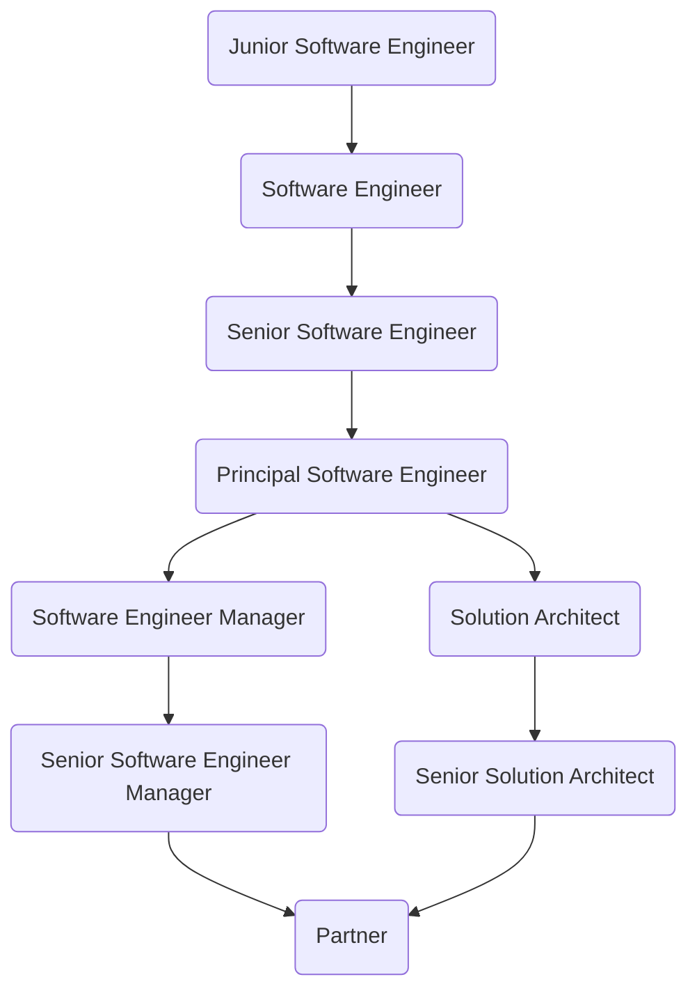

# Stakater Career Paths - Managed Services

The career paths for managed services are as follows:

The process for going from one role to the next is described in the [process document](career-path-process.md).

## Junior Software Engineer

### Key Characteristics

- Internships and projects experience
- Undergraduate or graduate degree in computer science

### Knowledge and Experience

- Programming knowledge
- Ability to solve problems within area of knowledge
- Collaborative and learning attitude

### Leadership Competencies

- Integrity - takes responsibility for actions and consequences, interacts with integrity and honesty, admits mistakes
- Retrospective - actively seeks feedback from others, learns from successes and mistakes, resourceful in pursuing learning objectives
- Goal driven - drive to achieve stretched performance objectives, takes every opportunity to do more than expected, pursues goals with energy and drives through to completion, plans and prioritizes work effectively

### Performance Indicators

- High engagement in company activities, giving feedback
- Learning new technologies to improve day-to-day workflows

## Software Engineer

### Key Characteristics

- 0-5 years of software development experience
- Internships and projects experience
- Highly developed analytical capability
- Undergraduate or graduate degree in computer science

### Knowledge and Experience

- Programming expertise
- Ability to solve well-defined problems within area of expertise
- Understand and deliver business value related to each task
- Strong ability to elaborate complex technical concepts and challenges within team and in front of others
- Collaborative and strong learning attitude

### Leadership Competencies

- Integrity - takes responsibility for actions and consequences, interacts with integrity and honesty, admits mistakes
- Retrospective - actively seeks feedback from others, learns from successes and mistakes, resourceful is pursuing learning objectives
- Goal driven - drive to achieve stretched performance objectives, takes every opportunity to do more than expected, pursues goals with energy and drives through to completion, plans and prioritizes work effectively
- Cooperation - gains trust and support of others, actively contributes desires and energy to succeed as a team, influences without authority, works through disagreements without damaging relationships
- Business values - sees how personal contribution impacts business, takes actions based on understanding of customer needs

### Performance Indicators

- Managing deliverables on-time, within specified duration, exceeding quality expectations
- High engagement in company activities, giving constructive feedback
- Learning new technologies to improve and optimize day-to-day workflows

## Senior Software Engineer

### Key Characteristics

- 5-10 years of software development experience
- Technical leadership experience
- Certified

### Knowledge and Experience

- Ability to lead and deliver any project within their area of expertise
- Highly developed ability to foresee the impact their work in a bigger picture
- Can elaborate on business values and influence customer decisions
- Highly developed ability to collaborate and take lead
- Strong learning and sharing engagement

### Leadership Competencies

- Integrity - takes full responsibility for their own tasks as well as the team's tasks
- Courage - anticipates future problems and works to minimize or prevent them, constructively challenges current practices, acts decisively and proactively, resolves incidents effectively and finds root causes via blameless postmortems
- Influence without authority - adapts behavior and communication style to the needs of the audience, credibly communicates a well-developed point of view, develops relations with key decision makers, anticipates reaction and objections from others and is prepared for them
- Insight - benchmarks to discover opportunities for competitive advantage, simplifies complex issues into easily understandable elements
- Energize and engage - create a climate of trust in which people want to do their best, invites input from others and creates shared ownership, helps others understand the importance of their contributions to overall vision and goals

### Performance Indicators

- Client and customer satisfaction
- High engagement in company activities, with constructive feedback
- Quality, timing and accuracy of plans
- Consistent development performance
- Timely and satisfactory resolution of issues
- Certifications

## Principal Software Engineer

### Key Characteristics

- 10+ years of software development experience
- Project development life cycle expertise
- Hands-on expertise building and scaling platforms, infrastructure, and distributed systems
- End-to-end product delivery and long-term ownership of technical domains

### Knowledge and Experience

- Certified expert within area of expertise
- Highly developed ability to lead teams
- Strong incentive to improve engineering maturity, developer experience, and Stakater culture
- Strong grasp of Stakater’s commercial objectives and financial impact, aligning technical decisions with business growth.

### Leadership Competencies

- Enabler - sets challenging team goals and clear standards for success, aligns the work of team members towards shared goals, creates alignment among functions where needed, delegates appropriately and trust people to perform, measures progress and results and ensures accountability, provides information and resources to achieve results, empowers individuals to solve problems, make decisions and improve processes
- Guidance - leverages performance development and talent processes to build people capabilities, provides challenging and stretching tasks and assignment to drive development, gives direct actionable feedback, addresses difficult issues in timely manner, builds diverse teams

### Performance Indicators

- Demonstrates strong technical leadership that builds customer trust and confidence, resulting in additional consultant placements
- High engagement in company activities, with constructive feedback
- Acts as a strategic technical advisor to customers, identifying opportunities for further engagements and long-term partnership growth
- Coaches and levels up consultants, so customers request more Stakater engineers due to demonstrated delivery quality and expertise
- Strengthens Stakater’s technical brand at customers, making Stakater the preferred engineering partner

## Solution Architect

### Key Characteristics

- 5-10 years of software architecture experience
- Specialized in the whole software development lifecycle
- Experienced in technical planning and resource management

### Knowledge and Experience

- Technical expert in their field
- Highly developed ability to build lasting relationships with team leaders, managers and clients
- Highly developed ability to manage risks and resources
- Highly developed ability to provide management support
- Strong technical understanding of Stakater's business models and operations

### Leadership Competencies

- Communication - being the technical centerpiece of all the parties, they must be capable of communicating technical aspects, risks, challenges, and selling points clearly. Capable of providing advice, explanation, empathy, influence, and negotiation skills to navigate the solution with prowess.
- Awareness - be aware of the advantages as well as disadvantages of the people under management, the technical and business risks of the solution to ensure successful delivery
- Efficient - can break down solutions into well-defined and executable components with precise time, cost and resource estimates to properly plan the execution of the solution

### Performance Indicators

- Experienced in wide range of technical stack
- Self promoting with prominent open-source and online presence by sharing, blogging or speaking at events
- Have a strong business network
- Certifications

## Senior Solution Architect

### Key Characteristics

- 10+ years of software architecture experience
- Specialized in complete solution delivery
- Experienced in technical planning and resource management across multiple solutions

### Knowledge and Experience

- Technically expert in their field and knowledgeable in up-and-coming trends
- Highly developed ability to build lasting relationships with team leaders, managers and clients
- Highly developed ability to manage risks and resources
- Highly developed ability to provide management support
- Strong technical understanding of Stakater's strategies

### Leadership Competencies

- Communication - being the centerpiece for all the parties, they must be capable of communicating technical aspects, risks, challenges, and selling points clearly. Capable of providing advice, explanation, empathy, influence, and negotiation skills to navigate the solution with prowess
- Awareness - be aware of the advantages as well as disadvantages of the people under management, the technical and business risks of the solution to ensure successful delivery
- Efficient - can break down solutions into well-defined and executable components with precise time, cost and resource estimates to properly plan the execution of the solution

### Performance Indicators

- Experienced in wide range of technical stack and solutions
- Self promoting with prominent open-source and online presence with regular exposure to target community and businesses
- Have a strong business network and influence
- Can manage multiple solutions in parallel

## Software Engineer Manager

### Key Characteristics

- 10-15 years of leadership experience
- Managing multiple teams of consultants, software engineers
- Experienced in planning strategic target execution for the team under supervision

### Knowledge and Experience

- Highly developed ability to plan and manage team and projects
- Highly developed ability to execute business strategies
- Highly developed ability to build strong relationships with team leaders, managers and clients
- Deep and wide understanding of software development
- Thorough understanding of emotional intelligence
- Thorough understanding of leadership styles
- Strong business and technical understanding of Stakater's operations
- Strong understanding of risks and risk management

### Leadership Competencies

- Trust - build trusting relationships through transparency, honesty and openness
- Communication - set clear responsibilities and expectations to ensure smooth executions of goals and lasting relationships
- Foresight - plan and carry out strategic targets by using the strength of supervised team. Well aware of both long and short term risks which might affect their team as well as Stakater's business and strategic goals.
- Vision - can elaborate complex goals into clear overall vision to lead teams towards its fulfilment

### Performance Indicators

- Stakater's strategic targets execution
- Mentoring effectiveness to help supervised teams deliver on their performance goals
- Creating and developing new area of operation in alignment with Stakater's overall strategy
- Risk awareness and risk mitigation ability

## Senior Software Engineer Manager

### Key Characteristics

- 15+ years of leadership experience
- Managing multiple teams of consultants, software engineers
- Experienced in planning strategic target execution across multiple teams

### Knowledge and Experience

- Highly developed ability to manage multiple teams
- Highly developed ability to contribute and execute business strategies
- Highly developed ability to build strong relationships with team leaders, managers and clients
- Strong business and technical understanding of Stakater's strategies and operations
- Strong understanding of risks and risk management
- Highly developed ability to recognise future trends and opportunities

### Leadership Competencies

- Communication - set clear responsibilities and expectations to ensure smooth executions of goals and lasting relationships
- Foresight - plan and carry out strategic targets by utilising the strength of all supervised teams. Well aware of both long and short term risks which might affect Stakater's business and strategic goals.
- Vision - can elaborate complex goals into clear overall vision to lead teams towards its fulfilment

### Performance Indicators

- Stakater's strategic targets execution
- Contributions to Stakater's strategies and future target areas
- Mentoring effectiveness to help supervised teams deliver on their performance goals
- Creating and developing new area of operation in alignment with Stakater's overall strategy
- Risk awareness and risk mitigation ability
- Self promoting with strong online presence within relevant community

## Partner

### Key Characteristics

- Successful delivery on top-line and bottom-line business results
- Proven track record of generating demand and selling consulting projects to clients
- Developing new client relationships and maintaining existing ones
- Highly developed ability to clearly demonstrate the impact and value of our work for potential clients
- Manages strategic business unit operations and large portfolio of projects
- Develop business relationship with key customers to ensure strategic alignment and continuously improve customer satisfaction

### Knowledge and Experience

- Expert knowledge of Stakater core technologies
- Business plan development and execution for products and services
- Ability to build and execute objectives and sales plans by building business relationship with customers
- Highly developed ability translate company purpose into meaningful terms for employees at every level in the organization
- Highly developed ability to build relationships based on mutual respect and open communication focused on achieving common objectives
- Skilled in people development
- Must display strong work ethics, integrity and total honesty
- Must demonstrate commitment to excel in total quality in their approach

### Leadership Competencies

- Accelerate - creates an environment for open and rigorous talent assessment, considers talent implications in short- and long-term context, establishes a diverse and robust talent pipeline, holds manager accountable for people development, actively shares knowledge and mentors
- Innovate - is seen as credible and respected, inspires and motivates entire groups, unites people to commit to organizational strategy and goals, develops and communicates compelling and inspired vision of the future, presents strategy so that it is understood by everyone
- Strategic - focuses on long term business development without losing sight of delivering short term value for shareholders, creates high performance culture to ensure sustained growth and operating profit, simplifies and remove barriers to organizational performance, enables and supports responsible risk taking, demonstrates entrepreneurial spirit

### Performance Indicators

- Revenue - sales growth
- Organic growth
- Operating profit
- Client satisfaction
- Quality, timing and accuracy of plans
- Recruitment and mentoring effectiveness
- Market share evolution - incremental clients, projects, services, consultants
- Business and people development
